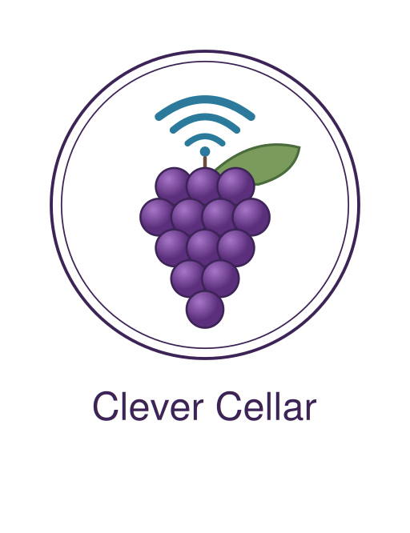

# Clever Cellar — Logo Pack

Pack complet du logo Clever Cellar : versions vectorielles (SVG) et bitmap (PNG) pour tous les usages.

## Palette officielle

| Élément       | Couleur       | Hex       |
|---------------|---------------|-----------|
| Raisin clair  | Violet clair  | `#A876C8` |
| Raisin foncé  | Violet vin    | `#5B2F7C` |
| Contour grain | Violet profond| `#3D2456` |
| Wi-Fi         | Bleu          | `#2B7A9B` |
| Feuille       | Vert vigne    | `#7A9B5C` |
| Contour feuille| Vert foncé   | `#4A6B3C` |
| Tige          | Marron        | `#6B4E3D` |

## Fichiers SVG (vectoriels — à privilégier)

| Fichier                       | Usage recommandé                                      |
|-------------------------------|-------------------------------------------------------|
| `clever_cellar_logo_full.svg` | Logo complet avec texte — portail, doc, en-tête README |
| `clever_cellar_icon.svg`      | Icône seule (sans texte) — app Flutter, splash screen |
| `clever_cellar_engraving.svg` | Version trait noir — gravure laser/CNC sur boîtier 3D |

## Fichiers PNG (bitmap — pour usages spécifiques)

### Logo complet avec texte
- `clever_cellar_logo_full_512px.png` — README GitHub, slides
- `clever_cellar_logo_full_1024px.png` — documentation HD
- `clever_cellar_logo_full_2048px.png` — impression, retina

### Icône (sans texte, format carré)
- `clever_cellar_icon_128px.png` — petit affichage UI
- `clever_cellar_icon_256px.png` — Android `mipmap-xxhdpi`
- `clever_cellar_icon_512px.png` — Play Store icon
- `clever_cellar_icon_1024px.png` — App Store icon

### Favicons (web)
- `favicon_16px.png` — onglet navigateur classique
- `favicon_32px.png` — onglet navigateur retina
- `favicon_48px.png` — raccourci Windows
- `favicon_64px.png` — tuile / écran d'accueil
- `favicon.ico` — fichier multi-résolution (16/32/48) à placer à la racine du site

### Gravure (trait noir, sans remplissage)
- `clever_cellar_engraving_512px.png`
- `clever_cellar_engraving_1024px.png`
- `clever_cellar_engraving_2048px.png` — pour découpe haute précision

## Intégration

### Portail web (HTML)
```html
<link rel="icon" type="image/x-icon" href="/favicon.ico">
<link rel="icon" type="image/png" sizes="32x32" href="/favicon_32px.png">
<link rel="apple-touch-icon" sizes="180x180" href="/clever_cellar_icon_256px.png">

<!-- En-tête -->

```

### Documentation Markdown
```markdown

```

### App Flutter (`pubspec.yaml`)
```yaml
flutter:
  assets:
    - assets/logo/clever_cellar_icon.svg
```

Utiliser le package `flutter_svg` pour afficher le SVG directement.

### Gravure boîtier
Importer le fichier `clever_cellar_engraving.svg` dans LightBurn, Inkscape ou Fusion 360. Les contours sont en trait noir 2.5–3 px (à adapter selon la puissance laser).

## Source

Logo conçu en SVG natif. Pour modifier la palette ou la composition, éditer directement les fichiers `.svg` (ouverts par Inkscape, Illustrator, Figma, ou même un éditeur de texte).
